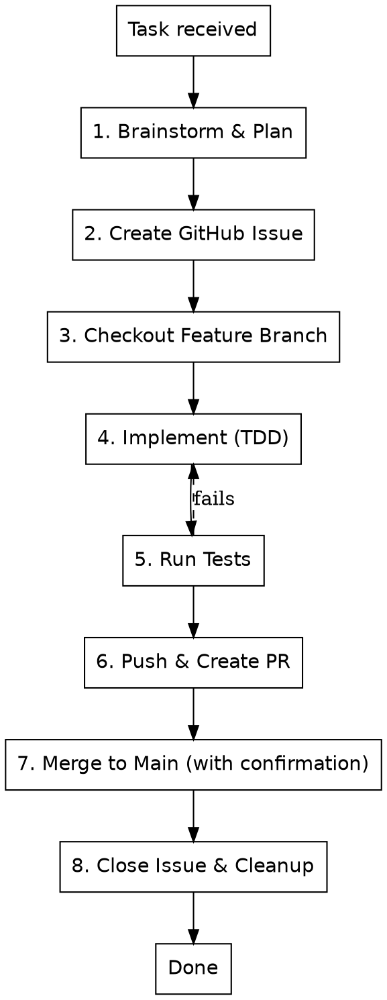

# Fix Issue Workflow

## Overview

Complete development workflow: from analysis through implementation to merge.

## When to Use

- Implementing new features
- Fixing bugs
- Refactoring code
- Any code change requiring a GitHub issue

## Workflow



## Steps

### 1. Brainstorm & Plan
**REQUIRED:** Use `superpowers:brainstorming` before any code changes.

```
superpowers:brainstorming "[task description]"
```

### 2. Create GitHub Issue
```bash
gh issue create \
  --title "[type]: [description]" \
  --body "## Description\n\n[details]\n\n## Acceptance Criteria\n\n- [ ] criterion 1" \
  --label "enhancement|bug" \
  --milestone "[current milestone]"
```

Capture the issue number: `#NNN`

### 3. Checkout Feature Branch
```bash
git checkout -b feature/NNN-short-name main
```

### 4. Implement with TDD
**REQUIRED:** Use `superpowers:test-driven-development`

- Write tests first
- Watch them fail (RED)
- Write minimal code (GREEN)
- Refactor

### 5. Run Tests
```bash
python -m pytest tests/ -v
```

All tests must pass. Fix failures before proceeding.

### 6. Push & Create PR
```bash
git add -A
git commit -m "[type]: [description] (#NNN)

Co-authored-by: Qwen-Coder <qwen-coder@alibabacloud.com>"
git push origin feature/NNN-short-name
gh pr create --base main --head feature/NNN-short-name --title "[type]: [description] (#NNN)" --body "[PR body]"
```

### 7. Merge to Main (with user confirmation)
**REQUIRED:** Use the `GitHub PR Merge Workflow` skill.

After the PR is created:

1. **Ask the user for confirmation:** "PR #[N] created. Do you want me to merge it to main now?"
2. **If user confirms:** Invoke the `GitHub PR Merge Workflow` skill to perform the merge
3. **If user declines:** Stop and let the user handle the merge manually

**NEVER merge without explicit user confirmation.**

**NEVER delete the feature branch before merge is complete.**

### 8. Close Issue & Cleanup
```bash
gh issue close NNN
git checkout main
git pull origin main
git branch -D feature/NNN-short-name
```

## Commit Types

| Type | Use for |
|------|---------|
| feat | New feature |
| fix | Bug fix |
| refactor | Code restructuring |
| test | Adding tests |
| docs | Documentation |
| chore | Maintenance |

## Red Flags

- **No brainstorming first** → STOP. Use superpowers:brainstorming.
- **No GitHub issue** → STOP. Create issue before branch.
- **Tests failing** → STOP. Fix before merge.
- **Committing to main directly** → STOP. Use feature branch + PR.
- **Merge without confirmation** → STOP. Always ask user before merging.
- **Delete branch before merge** → STOP. Branch must exist for PR merge.
